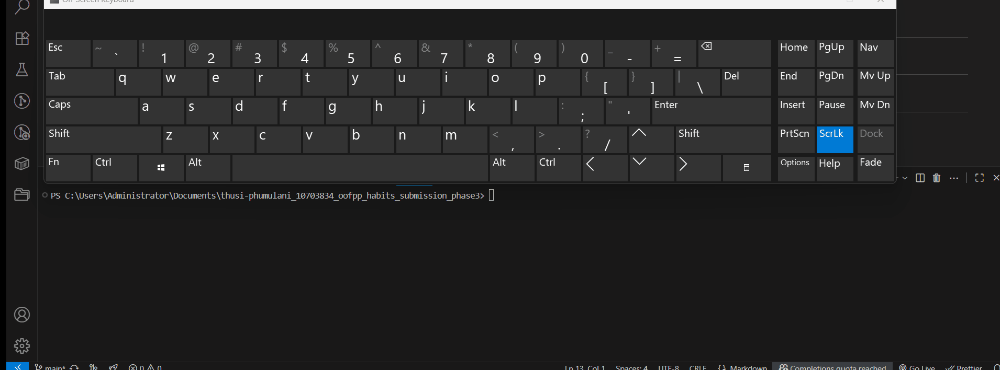

# Content
- [Overview](./docs/project_overview.md)
- [Creating a habit](./docs/add_habit_component.md)
- [Get Habits](./docs/search_habit.md)
- [Delete a habit](./docs/delete_habit_component.md)
- [Updating a habit](./docs/update_habit.md)
- [Search for a habit](./docs/search_habit.md)
#

## Install required modules

## Running the project

