# Add Habit Component

## Overview

The **AddHabitView** component is responsible for guiding the user through creating a new habit in the command-line interface.

It collects all required habit fields, validates user input, optionally configures a repeat pattern, and finally saves the habit.

This component follows a **command-driven interaction loop**, where each user action is mapped to a command handler.

Gifs can be used to illustrate steps for the user in action.

---

## Responsibilities

The AddHabitView handles:

* Collecting habit name
* Collecting start date and time
* Collecting optional description
* Collecting session duration
* Validating required fields
* Displaying filled values
* Configuring repeat patterns
* Saving the habit

---

## Internal State

The component maintains the following internal fields:

| Field                      | Type           | Description                                |
| -------------------------- | -------------- | ------------------------------------------ |
| `__habit_name`             | string         | Name of the habit                          |
| `__start_datetime`         | string         | Start date and time                        |
| `__description`            | string or None | Optional description                       |
| `__habit_session_duration` | string         | Duration of one habit session              |
| `save_called`              | bool           | Indicates whether save was executed        |
| `pattern_is_set`           | bool           | Indicates if repeat pattern was configured |

---

## High-Level Flow

1. User enters the Add Habit screen.
2. The command loop presents available commands.
3. Each command triggers a handler method.
4. Decorators manage repeated prompting and validation.
5. When all required fields exist, the habit can be saved.

Gif example:

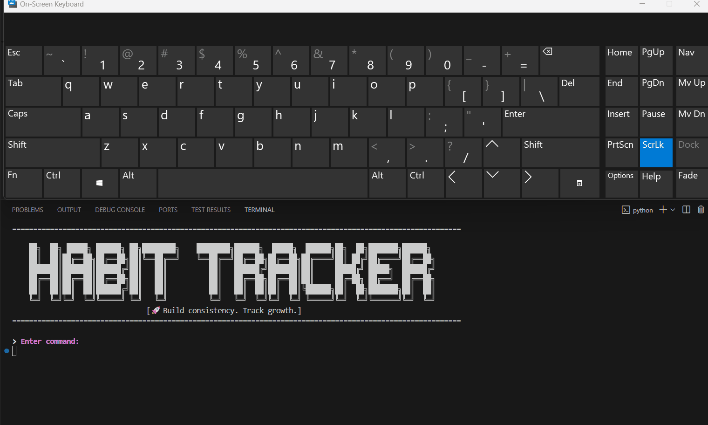

---

## Command Loop

The `execute()` method starts the main command loop.

Available commands:

| Command                      | Description                   | Gif                                           |
| ---------------------------- | ----------------------------- | --------------------------------------------- |
| `set habit name`             | Sets the habit name           | 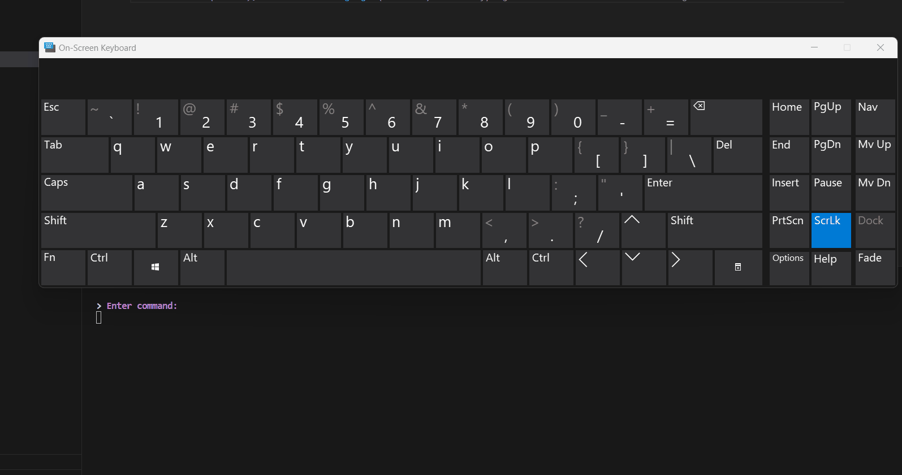        |
| `habit description`          | Adds an optional description  | 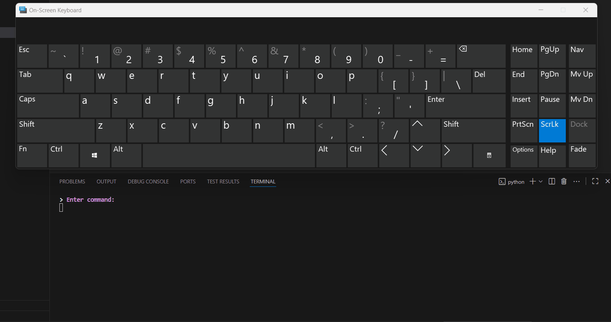    |
| `set start datetime`         | Sets the start date and time  | 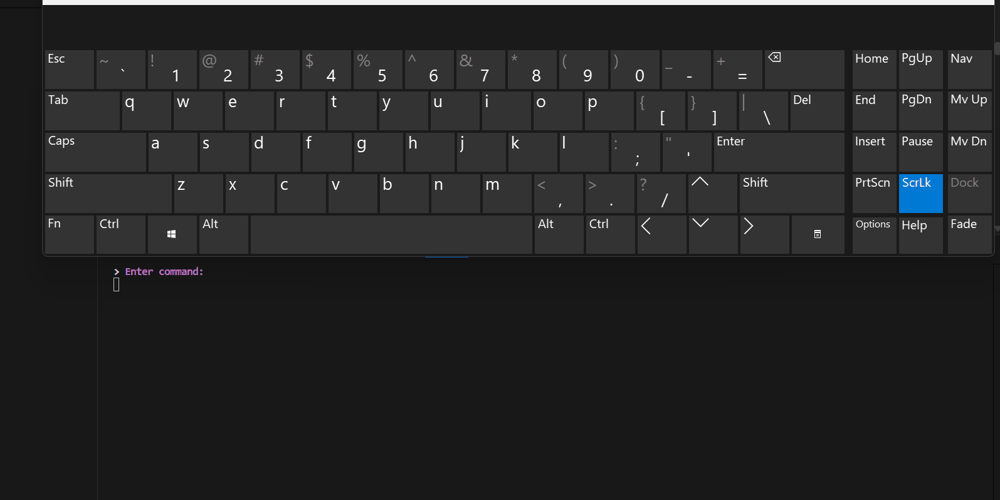  |
| `set habit session duration` | Sets the session duration     | 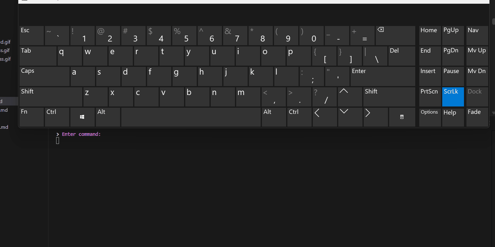  |
| `display habit details`      | Prints filled habit details   | 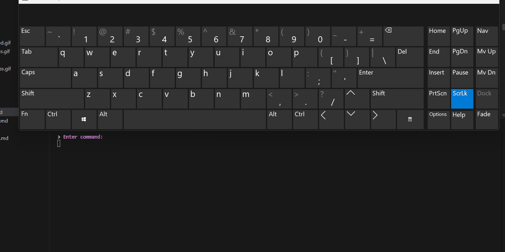    |
| `view filled field values`   | Shows currently filled fields | 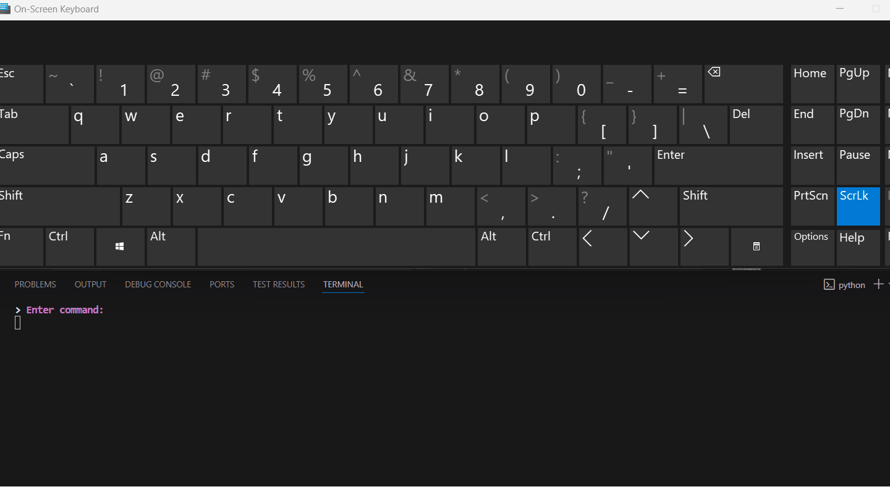 |
| `save habit`                 | Saves the habit               | 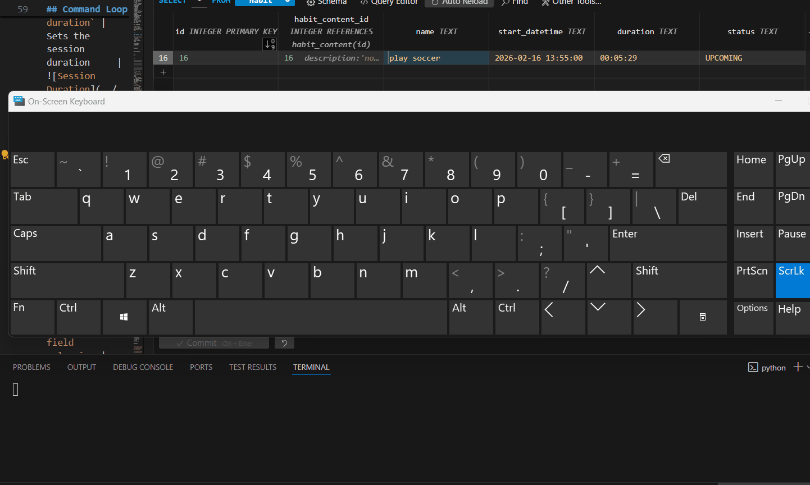          |
| `reset habit`                | Resets all fields to empty    |         |

Each command maps directly to a handler method.

---

## Input Handling Pattern

Most input operations follow a shared pattern:

1. Prompt user for input.
2. Validate input in a `*_logic()` method.
3. Return `(command, message, success)` tuple.
4. Decorators handle retry or single-execution behavior.

This ensures consistent validation across all fields.

---

## Field Input Methods

### Habit Name

* Must be longer than 2 characters.
* Must be shorter than 30 characters.
* Stores result in `__habit_name`.

Methods:

* `set_habit_name_logic(command)`
* `set_habit_name()`

Gif:

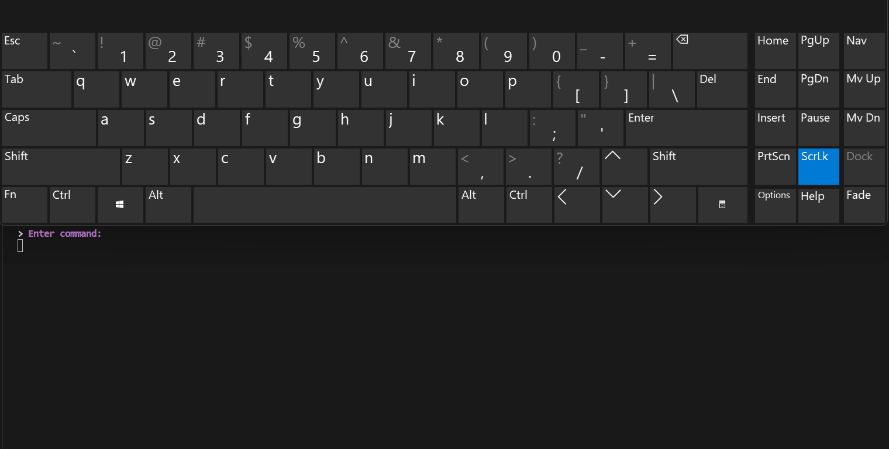

---

### Start Date & Time

* Uses DateTimeHandler for validation.
* Expected format: `yyyy-mm-dd, HH:MM`

Methods:

* `set_start_datetime_logic(command)`
* `set_start_datetime()`

Gif:

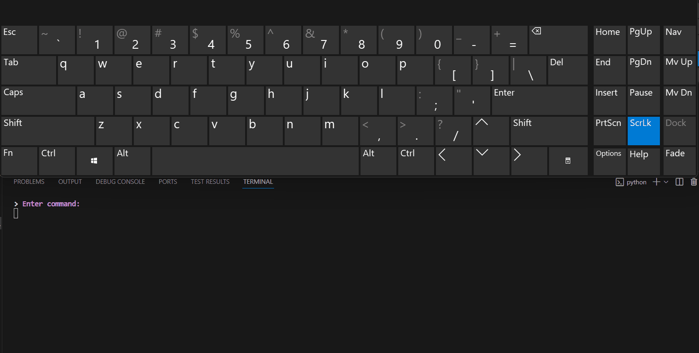

---

### Description

* Optional field.
* Maximum 50 characters.
* Empty input skips description.

Methods:

* `set_habit_description_logic(command)`
* `set_habit_description()`

Gif:

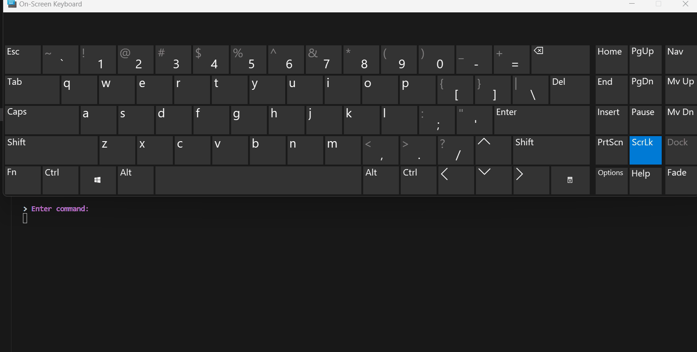

---

### Session Duration

* Uses DateTimeHandler for validation.
* Expected format: `HH:MM:SS`

Methods:

* `set_habit_session_duration_logic(command)`
* `set_habit_session_duration()`

Gif:


---

## Validation of Required Fields

Before saving or displaying details, required fields are checked:

Required:

* Habit name
* Start datetime
* Session duration

Validation method:

* `all_fields_exist()`

Returns a success flag and message.

---

## Repeat Pattern Configuration

After saving validation succeeds, the user may configure repeat patterns:

* Prompt: `"Do you want to set a repeat pattern?"`
* If yes → Delegates to `HabitTimeRepeatsView`.

Methods:

* `set_pattern_logic(command)`
* `set_pattern()`

Gif:

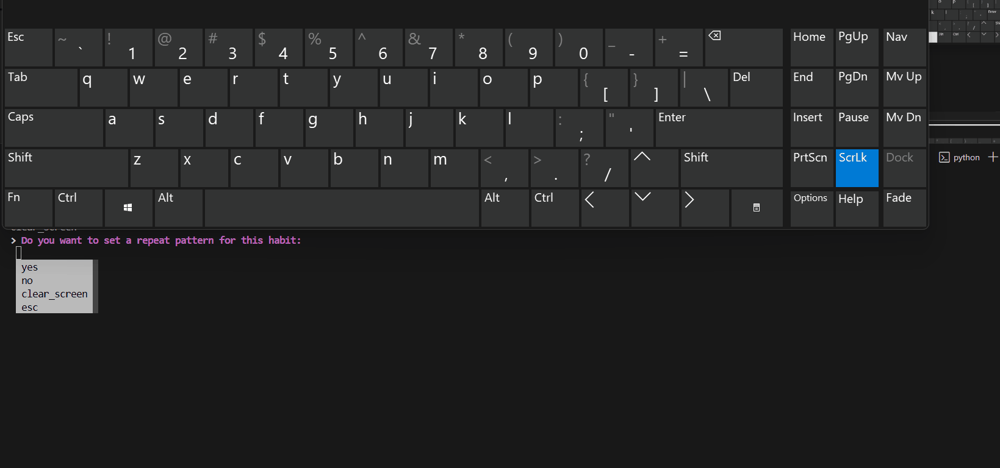

---

## Saving the Habit

Saving performs:

1. Required field validation.
2. Optional repeat pattern setup.
3. Marks `save_called = True`.

Methods:

* `save_logic()`
* `save()`

Gif:


---

## Displaying Habit Details

Once fields exist, the habit details can be printed to the console.

Methods:

* `display_habit_details_logic()`
* `display_habit_details()`

Gif:


---

## Viewing Filled Fields

The user can view currently filled fields at any time.

Method:

* `view_filled_field_values()`

Unfilled fields are ignored.

Gif:


---

## Resetting State

The component can be reset to initial empty state.

Method:

* `reset()`

Gif:


---

## Design Notes

* Business logic is separated from user prompting.

* Decorators manage repeated prompting and execution control.

* Validation functions always return a standard tuple:

  `(command, message, success)`

* This uniform contract allows decorators to remain generic.

* Gifs are included to improve user onboarding and clarity.

---

## Entry Point

The component can be launched directly:

```python
if __name__ == "__main__":
    view = AddHabitView()
    view.execute()
```