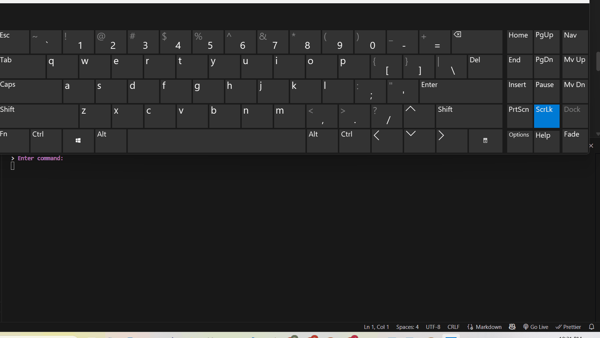
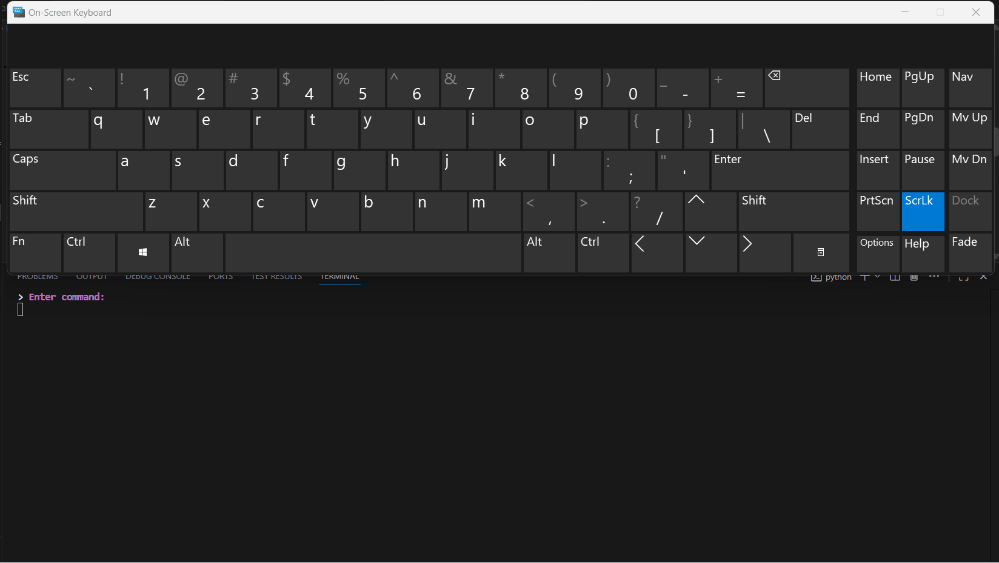
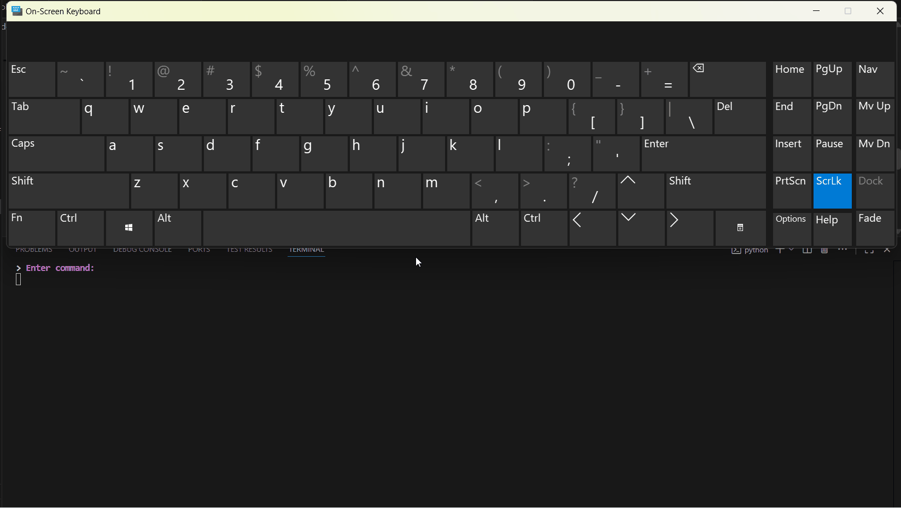

# Delete Habit Component

## Overview

The **DeleteHabitController** component allows users to safely delete a habit from the database via the command-line interface.

It ensures:

* Habit exists before deletion
* Reflections and descriptions are preserved until deletion
* User confirmation before removing

---

## Responsibilities

* Select habit by ID
* Fetch habit details from database
* Confirm deletion
* Delete habit using HabitFactory
* Provide feedback on successful deletion

---

## Internal State

| Field            | Type         | Description                      |
| ---------------- | ------------ | -------------------------------- |
| `habit_factory`  | HabitFactory | Handles database operations      |
| `get_habit_view` | GetHabitView | Displays habits and collects IDs |

---

## High-Level Flow

1. User chooses the habit to delete.
2. Habit details are fetched for confirmation.
3. `delete()` method deletes the habit.
4. ID is reset to prevent accidental reuse.

Gif example:



---

## Command Loop

The `execute()` method provides commands:

| Command            | Description                 | Gif                                      |
| ------------------ | --------------------------- | ---------------------------------------- |
| `use get commands` | View habits before deletion |      |
| `delete`           | Deletes selected habit      |  |

---

## Deleting a Habit

Steps:

1. `set_id_of_habit_to_modify()` collects the habit ID.
2. Habit is fetched from DB.
3. Habit object is created with description, reflections, and status.
4. `HabitFactory.delete_habit()` removes the entry.

Gif:


---

## Design Notes

* Business logic is cleanly separated from user interaction.
* Habit deletion is safe and idempotent.
* Views are responsible for displaying feedback and collecting user IDs.

---

## Entry Point

```python
if __name__ == "__main__":
    controller = DeleteHabitController()
    controller.execute()
```
