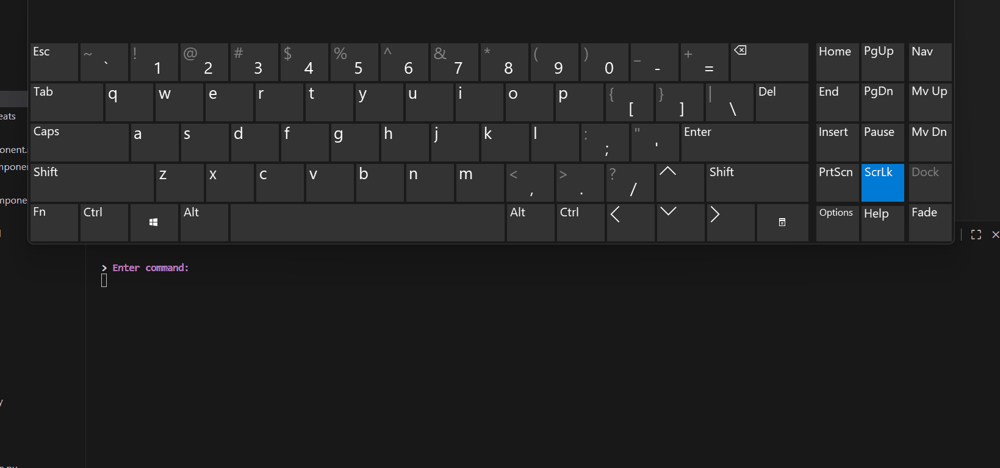
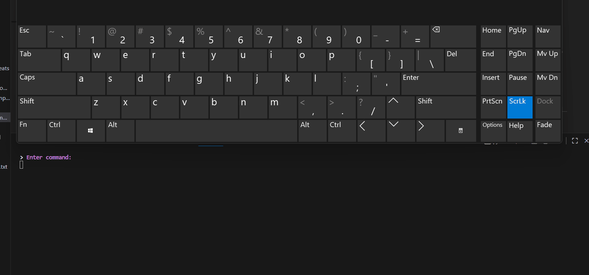
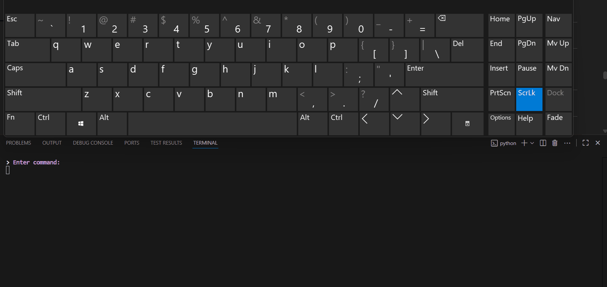

# Habit Time Repeats Component

## Overview

The **HabitTimeRepeatsView** component allows users to define **weekly and monthly repeat patterns** for habits via the command-line interface.

It is **command-driven**, using decorators for repeated prompting and validation, and integrates with `AddHabitView` or `UpdateHabitView` to set habit schedules.

Gifs illustrate user interactions for each step.

---

## Responsibilities

The component handles:

* Creating week patterns (e.g., Mon, Tue, Fri)
* Naming week patterns
* Editing and deleting week patterns
* Creating month patterns using saved week patterns
* Ordering month patterns
* Viewing current patterns
* Ensuring input validation and preventing name clashes

---

## Internal State

| Field                      | Type      | Description                                    |
| -------------------------- | --------- | ---------------------------------------------- |
| `week_pattern`             | list[str] | Current week pattern under creation            |
| `week_pattern_collection`  | dict      | Stores named week patterns                     |
| `month_pattern`            | dict      | Stores month patterns built from week patterns |
| `ordered_monthly_patterns` | list      | Final ordered month patterns                   |
| `month_pattern_name`       | str       | Name of the month pattern being created        |
| `command`                  | str       | Current command being executed                 |
| `field_to_edit`            | str       | Field being edited in a week pattern           |
| `use_auto_go_back`         | bool      | Determines if auto navigation is enabled       |
| `color`                    | Colors    | Handles colored CLI outputs                    |

---

## High-Level Flow

1. User selects a command (e.g., create week pattern, view patterns, create month pattern).
2. Component validates input.
3. Week patterns are saved to `week_pattern_collection`.
4. Month patterns are built using week patterns.
5. Patterns can be edited, deleted, or ordered.
6. Resulting data can be used in habit scheduling.

Gif example: (sorry this is about a minute long check out the other ones if you want to quickly see what is up)


---

## Command Loop

The `execute()` method maps commands to handlers:

| Command                | Description                                | Gif                                            |
| ---------------------- | ------------------------------------------ | ---------------------------------------------- |
| `create week pattern`  | Creates a new week pattern                 |  |
| `view week patterns`   | Shows saved week patterns                  |             |
| `delete week pattern`  | Deletes a week pattern                     |          |
| `create month pattern` | Builds a month pattern from week patterns  |        |
| `edit week pattern`    | Edits a week pattern                       |              |
| `view month pattern`   | Displays current month patterns            |            |
| `order month patterns` | Orders month patterns for habit scheduling |          |

---

## Week Pattern Workflow

1. **Set week pattern:** User selects weekdays (e.g., Mon, Wed, Fri)
2. **Assign pattern name:** Prompted for a unique name
3. **Validation:** Ensures at least 3 characters and uniqueness

Methods:

* `set_week_pattern_logic()`
* `set_week_pattern()`
* `set_pattern_name_logic()`
* `set_pattern_name()`

Gif:


---

## Month Pattern Workflow

1. User selects 4 week patterns to form a month.
2. Assign a name to the month pattern.
3. Month pattern is saved in `month_pattern`.
4. Patterns can be reordered for scheduling.

Methods:

* `create_month_pattern_logic()`
* `create_month_pattern()`
* `order_month_patterns_logic()`
* `order_month_patterns()`

Gif:


---

## Editing and Deleting Patterns

* Edit week pattern titles or bodies
* Delete unwanted week patterns
* View current patterns for confirmation

Methods:

* `edit_week_pattern_logic()`
* `edit_week_pattern()`
* `delete_week_pattern_logic()`
* `delete_week_pattern()`

Gif:


---

## Input Validation Pattern

All user inputs follow this contract:

1. Prompt user for input.
2. Validate with `*_logic()` method.
3. Return `(command, message, success)`.
4. Decorators handle retries (`@run_until_successful`) or single execution (`@command_once`).

Gif:


---

## Design Notes

* Business logic is separated from CLI input handling.
* Decorators ensure consistent retry and execution behavior.
* Week and month patterns are stored in memory until saved in a habit.
* Gifs guide the user through the complex repeat scheduling process.

---

## Entry Point

```python
if __name__=="__main__":
    view = HabitTimeRepeatsView()
    view.execute()
```

Gif example:


