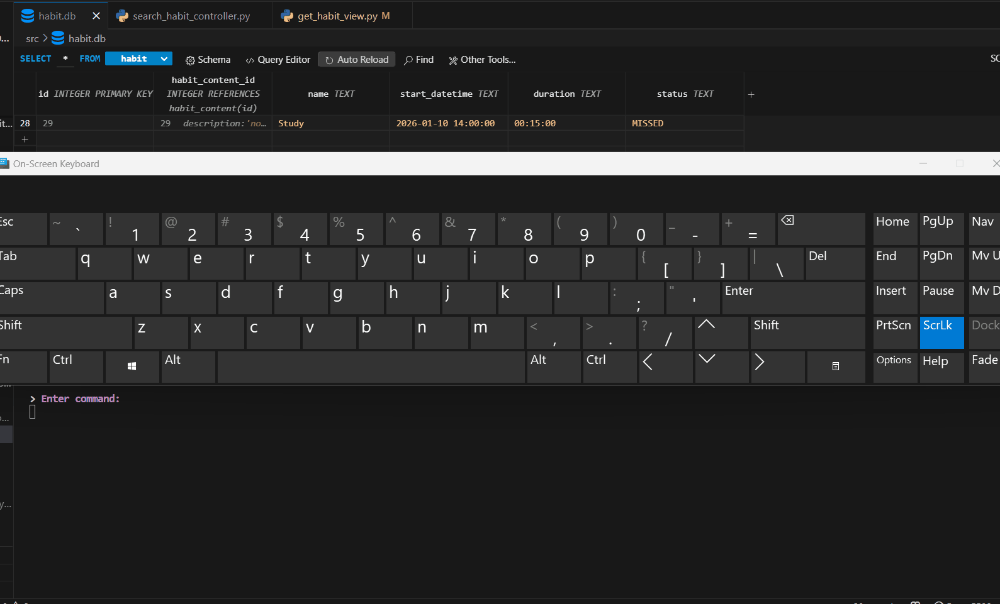
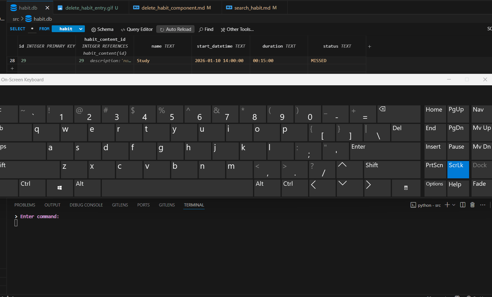
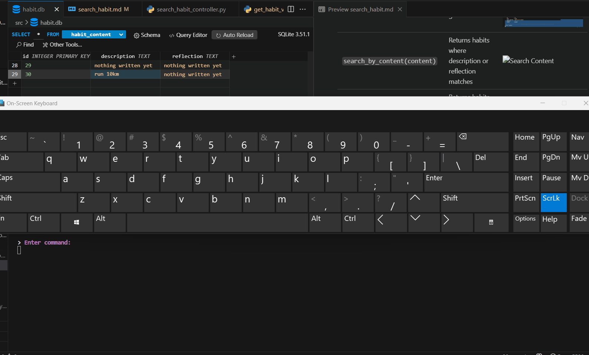
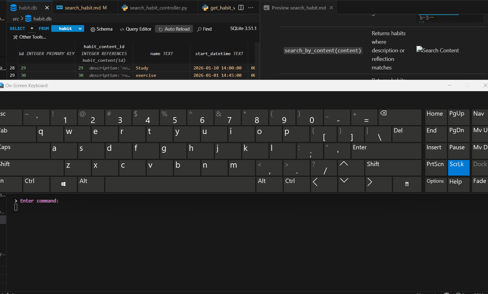

# Search Habit Component

## Overview

The **SearchHabit** component provides functionality to **search for habits** based on various criteria.

It acts as a **controller layer** between the database (`HabitFactory`) and the user interface.

Gifs can illustrate how searches return results in the CLI.

---

## Responsibilities

The component handles:

* Searching habits by **name**
* Searching habits by **status** (e.g., UPCOMING, DONE)
* Searching habits by **content** (description or reflections)
* Searching habits by **exact date**
* Searching habits by **month** (optional year)

---

## Internal State

| Field           | Type         | Description                               |
| --------------- | ------------ | ----------------------------------------- |
| `habit_factory` | HabitFactory | Provides access to habit database methods |

---

## High-Level Flow

1. Component is initialized with a `HabitFactory` instance.
2. User specifies a search criterion (name, status, content, date, or month).
3. Component queries the database and returns results.
4. Results can be displayed in the CLI.


---

## Search Methods

| Method                              | Description                                            | Gif                                          |
| ----------------------------------- | ------------------------------------------------------ | -------------------------------------------- |
| `search_by_name(name)`              | Returns a habit with exact name or similar match       |        |
| `search_by_status(status)`          | Returns all habits with a given status                 |    |
| `search_by_content(content)`        | Returns habits where description or reflection matches |  |
| `search_by_date(date)`              | Returns habits starting on a specific date             |        |
| `search_by_month(month, year=None)` | Returns habits in a given month (optionally year)      |      |

---

## Input Handling Pattern

* Input is received from the calling component (e.g., CLI view).
* Each method validates internally and queries the database.
* Results are returned as a list of tuples.


---

## Design Notes

* Focused purely on **search logic**.
* Delegates data access to `HabitFactory` → `Database`.
* Returns raw database entries for flexibility.
* Can be easily extended with filters or fuzzy matching.

---

## Entry Point

```python
if __name__ == '__main__':
    search = SearchHabit()
    results = search.search_by_status('UPCOMING')
    print(results)
```
